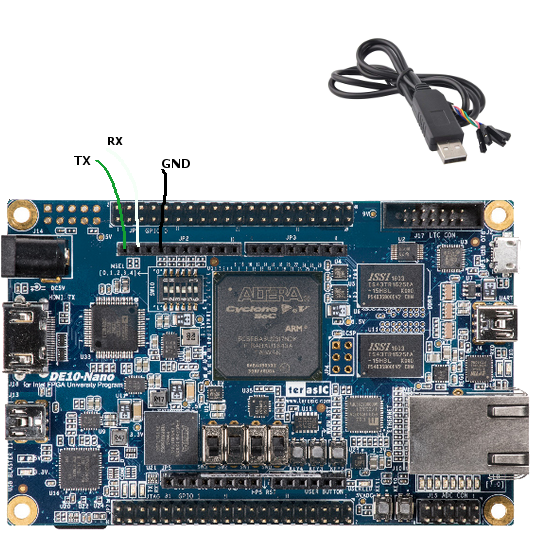

Altair8800_Mister
=================
By Fred VanEijk and Cyril Venditti.

## What is an Altair 8800
https://en.wikipedia.org/wiki/Altair_8800

## How to control the MiSTer Altair8800
- To move the cursor use the directional arrow keys (Left – Right – Up – Down).

- Toggle switches
  - SENSE/DATA/ADDRESS
  - OFF/ON
  - STOP/RUN
    - 0 keys - Off - down
    - 1 keys - On - up

- Momentary switches
  - SINGLE STEP
  - EXAMINE
  - DEPOSIT
  - RESET
    - 1 keys - Up
    - 2 keys - Down

- Non implemented switches
  - CLR
  - PROTECT
  - AUX

## Available samples 
These samples are accessible through the MiSTer Core OSD (F12) in the "Select Program" section. 

- Empty

      256 bytes of zeroed memory at address 0x0000.

- zeroToseven

      256 bytes of memory with 1st 8 bytes as 0 to 7.
          
- KillBits

      Kill the Bit game by Dean McDaniel, May 15, 1975
      Object: Kill the rotating bit. If you miss the lit bit, another bit turns on leaving two bits to destroy. 
      Quickly toggle the switch, don't leave the switch in the up position. 
      Before starting, make sure all the switches are in the down position.
       
- SIOEcho (See Serial port section)

      256 bytes to test serial port at port 00/01.
      Just echos the character typed on the terminal.
  
- StatusLights

      Demonstrate status light combinations.
      Halts the cpu when done so requires a reset of the core.

- Basic4k32 (see Serial port section)

      Basic interpreter in 4k ram at 0x0000 with a total of 8k of memory including the interpreter.
      Comumicates with serial port requires SENSE swithes to be set to 0xFD.
      this is the basic interpreter originally created by Bill Gates and Paul Allen.

## Basic Altair operation
http://altairclone.com/altair_experience.htm

## OSD explanation
MiSTer Core OSD (F12) :

- “Select Program”

      See Available samples section.

- “Load Program”

      To Load a program first select a program using the select program option then press “Load Program”. 
      Once you press ”Load Program” the Core will place that program in memory.

- “Enable TurnMon” 

      Makes available the turn key monitor at address 0xFD00.
      See file "Altair8800_Mister/core/roms/altair/turnmon.txt".
  
## Serial port - Todo
- Altair8800 Switch settings
- Hardware Wiring or I/O Board v5.5
  - You can use any USB to 3.3V TTL Serial Cable Adapter should work.
  - RX SCL Arduino_IO15.
  - RX SDA Arduino_IO14.
  - Don't forget to wire the Ground.
- Use Putty or TeraTerm for client use 19200 baud.

  
## Credits
  - We took some inspiration for displaying the Altair8800 front panel from https://timetoexplore.net/blog/arty-fpga-vga-verilog-01
  - Altair8800 front panel image from http://www.vintage-computer.com/altair8800.shtml
  - Core - Todo

## Not implemented
The following switches are not implemented:
   - CLR
   - PROTECT
   - AUX
