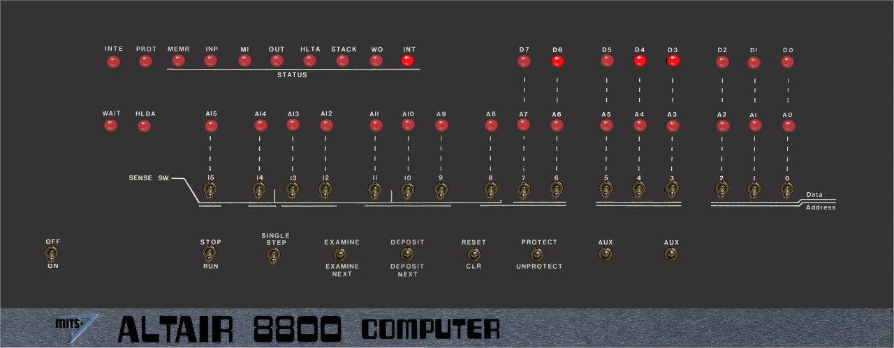

Altair8800_Mister
=================

By Fred VanEijk and Cyril Venditti.

## What is an Altair 8800
https://en.wikipedia.org/wiki/Altair_8800

## How to control the MiSTer Altair8800
- To move the cursor use the directional arrow keys (Left – Right – Up – Down).

- Toggle switches
  - SENSE/DATA/ADDRESS
  - OFF/ON
  - STOP/RUN
    - 1 key - On - up
    - 2 or 0 key - Off - down
    

- Momentary switches
  - SINGLE STEP
  - EXAMINE
  - DEPOSIT
  - RESET
    - 1 key - Up
    - 2 key - Down

- Not implemented switches
  - CLR
  - PROTECT
  - AUX

## Available samples 
These samples are accessible through the MiSTer Core OSD (F12) in the "Select Program" section. 

- Empty

      256 bytes of zeroed memory at address 0x0000.

- zeroToseven

      256 bytes of memory with 1st 8 bytes as 0 to 7.
          
- KillBits

      Kill the Bit game by Dean McDaniel, May 15, 1975
      Object: Kill the rotating bit. If you miss the lit bit, another bit turns on leaving two bits to destroy. 
      Quickly toggle the switch, don't leave the switch in the up position. 
      Before starting, make sure all the switches are in the down position.
       
- SIOEcho (See Serial port section)

      256 bytes to test serial port at port 00/01.
      Just echos the character typed on the terminal.
  
- StatusLights

      Demonstrate status light combinations.
      Halts the cpu when done so requires a reset of the core.

- Basic4k32 (see Serial port section)

      Basic interpreter in 4k ram at 0x0000 with a total of 8k of memory including the interpreter.
      Comumicates with serial port requires SENSE swithes to be set to 0xFD.
      this is the basic interpreter originally created by Bill Gates and Paul Allen.
      
  The Basic4k32 require the serial port to be setup and the sense switches to be set this way:
    - 15 to 10 ON
    - 9 OFF
    - 8 ON
    
## Altair operation
http://altairclone.com/altair_experience.htm

## OSD explanation
MiSTer Core OSD (F12) :

- “Select Program”

      See Available samples section.

- “Load Program”
  - Do this switch sequence:
    - Turn the ON/OFF switch to ON
    - Insure that the STOP/RUN switch is STOP
    - Load a program by using the "Select Program" option then press "Load Program". 
      Once you press "Load Program" the Core will place that program in memory.
  - Finally do:
    - RESET with the RESET/CLR switch
    - Turn the STOP/RUN switch to RUN
       
- “Enable TurnMon” 

      Makes available the turn key monitor at address 0xFD00.
      See file "Altair8800_Mister/core/roms/altair/turnmon.txt".
      
- “Reset” 

      This will reset the core.
      
  
## Serial port
- To use the serial port you need to have an I/O Board v5.5 or do a hardware Wiring:
  - Any USB to 3.3V (NOT 5.5V) TTL Serial Cable Adapter should work.
  - TX of the TTL Serial Cable Adapter -> First GPIO header: GPIO_D1 (PIN2)
  - RX of the TTL Serial Cable Adapter -> First GPIO header: GPIO_D0 (PIN1)
  - Don't forget to wire the Ground -> First GPIO header: Ground - PIN12
- Use Putty or TeraTerm for client and use the 19200 baud setting.

In case of Altera DE10-Standard the First GPIO header is JP1, because no other GPIO header

In case of Altera DE1-SoC the First GPIO header is JP1, the second is JP2

In case of Arrow SoCKit, there is no integrated GPIO header, you have to use HSTC-GPIO daughter board card and the first available GPIO header will be J3.

  
## Credits
  - Inspiration for displaying the Altair8800 front panel:
  
        https://timetoexplore.net/blog/arty-fpga-vga-verilog-01
                  
  - Altair8800 front panel image: 
  
        http://www.vintage-computer.com/altair8800.shtml
        
  - Core:
  
        https://github.com/1801BM1/vm80a

        https://zeptobars.com/en/read/KR580VM80A-intel-i8080-verilog-reverse-engineering

        https://hackaday.com/2015/03/07/looking-inside-the-kr580vm80a-soviet-i8080-clone/

        https://jeelabs.org/2016/09/i-never-had-an-intel-8080/

        https://github.com/mmicko/s100fpga

## Known issues
Depending on your monitor resolution the Altair8800 front panel might not be complete or centered.

## Not implemented
The following switches/functions are not implemented:
   - CLR
   - PROTECT
   - AUX
